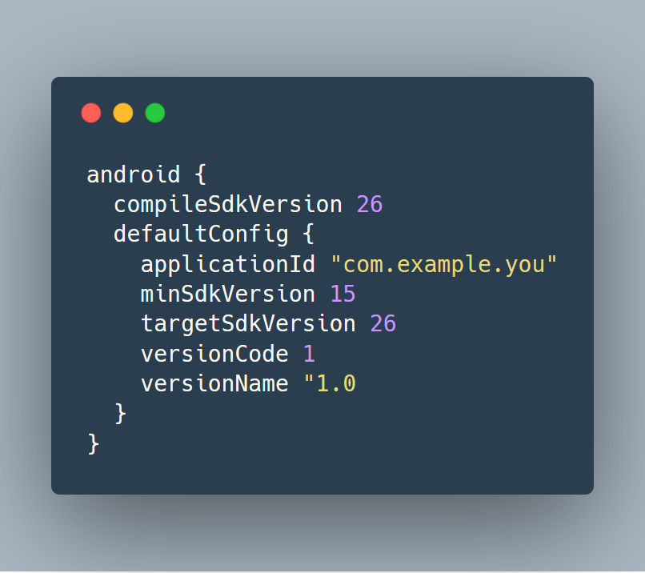

# 11. 시스템

도시에서는 한사람이 관리하지 않는다. 수도관리, 전력관리, 교통관리와 같이 적절한 추상화와 모듈화로 구성되어있다.

시스템에서는 관심사를 분리하거나 추상화를 이뤄내지 못한다.
이 장에서는 시스템이라는 높은 추상화 수준에서도 깨끗함을 유지하는 방법을 살펴본다.

 

## 시스템 제작과 시스템 사용을 분리하라

제작(Construction)과 사용(use)는 다르다.

소프트웨어 시스템은 준비과정(객체 생성, 의존성 연결)과 런타임 로직을 분리해야 한다.

관심사 분리는 우리 분야에서 가장 오래되고 가장 중요한 설계 기법 중 하나이다.

    public Service getService(){
    	if (service == null)
    		service = new MyServiceImple(...); // 모든 상황에 적합한 기본값일까?
    	return service;
    }

이것은 초기화 지연 코드이다. 

장점필요할 때 까지 객체 생성 하지않음.

- 필요할 때 까지 객체 생성 하지 않음.

- 어떠한 경우에도 null을 반환하지 않음

문제점

작게나마 단일 책임 원칙을 깬다.

* 함수가 서비스 제공과 초기화 두가지를 수행한다고 얘기하는 듯.

모든 상황에 적합한 객체인지 모른다.

이런 객체 생성 코드(설정 코드)가 곳곳에 있다면 모듈성이 저조하고 중복이 심각하다고 본다.

 

### Main 분리 - 196p

방법.

생성과 관련한 코드는 main과 main이 호출하는 모듈로 옮긴다. 나머지 시스템은 모든 객체가 생성되었고 모든 의존성이 연결되어 있다고 가정하고 사용만 한다.

* 안드로이드로 치면 App.class을 통하는듯

 

### 팩토리

애플리케이션 쪽에서 객체 생성 시점을 결정이 필요한 경우 **추상 팩토리 패턴**을 사용한다.

객체를 생성하는 시점은 애플리케이션이 결정하지만, 생성하는 코드는 애플리케이션이 모른다.

**추상 팩토리 패턴

 

### 의존성 주입

의존성 주입은 사용과 제작을 분리하는 강력한 메커니즘이다. 제어 역전 기법을 의존성 관리에 적용한 메커니즘이다.

* 제어역전 - 한 객체가 맡은 보조 책임을 새로운 객체에게 전적으로 떠넘긴다. 새로운 객체는 넘겨받은 책임만 맡으므로 단일 책임을 지키게 된다.

 

## 확장

매일 새로운 사용자 스토리에 따라 시스템을 조정하고 확장한다. 이것은 반복적이고 점진적인 애자일 방식의 핵심이다.

테스트 주도 개발, 리팩터링, 깨끗한 코드는 시스템을 조정하고 확장하기 쉽게 해준다.

시스템 수준에서는 관심사를 적절히 분리해 관리한다면 아키텍처는 점진적으로 발전할 수 있다.

관심사 분리 실패의 예를 다음과 같이 보여준다. 200p

EJB1, EJB2 아키텍처는 관심사를 적절히 분리하지 못했기에 유기적인 성장이 어려웠다.

EJB는 효율적인 서버 관리, 프로그램 문제를 처리해주는 컨테이너라고 보면 된다.

여기서 보여주는 문제점으로는 프로그램이 이 컨테이너와 강하게 결합된다.

비지니스 로직을 구현함에 있어서 EJB의 EntityBean을 상속 받아야하고, 컨테이너가 요구하는 다양한 생명 주기 메서드도 제공해야 한다. 

컨테이너가 밀접하게 결합된 탓에 단위 테스트가 어렵다. 컨테이너를 흉내 내거나 실제 서버에 배치 해야한다.

또한 이미 EntityBean을 상속 받으므로 다른 빈을 상속받지 못한다.

위와 같은 이유들로 객체 지향이라는 의미가 흔들리게 된다.

* 실 사용에서도 EJB 컨테이너의 목적은 관심사 분리와 재사용이었지만 사용처별 커스텀이 많이 되어 재사용이 거의 불가능하다.

 

### 횡단 관심사

EJB2 아키텍처에도 일부 관심사를 거의 완벽하게 분리한 부분이 있다.

트랜잭션, 보안, 일부 영속적인 동작들인데 이는 소스코드가 아닌 배치 기술자에서 정의된다.

영속성과 같은 관심사는 애플리케이션의 객체 경계를 넘나드는 경향이 있다. (이러한 문제점을 횡단 관심사라고 한다.)

이에 따라 관점 지향 프로그래밍(AOP)이라는 횡단 관심사에 대처하여 모듈성을 확보하는 방법론이 있다.

이 방법론 에서는 "특정 관심사를 지원하려면 시스템에서 특정 지점들이 동작하는 방식을 일관성 있게 바꿔야 한다" 라고 얘기한다. 

영속성을 예로 들면 프로그래머가 영속적으로 저장할 객체와 속성을 선언하여 영속성 프레임 워크에 위임을 하면, 프레임워크는 다른 코드에 영향을 미치지 않는 상태로 동작 방식을 변경한다.

다음 Java에서 사용하는 Aspect 메커니즘 세가지를 보자.

 

## 자바 프록시(203P)

코드상 프록시로 감쌀 인터페이스와 비즈니스 논리의 구현이 시스템과 분리되어 잘 구현이 되어있다.

프로시를 이용하기 위한 프록시 핸들러와 사용부가 조금 복잡하긴 하다.

두 가지의 단점으로 코드의 양과 복잡함이다. 즉 깨끗한 코드가 될 수 없고, AOP 해법에 필요한 시스템 단위의 실행 지점을 명시할 수도 없는 문제가 있다.

 

## 순수 자바 AOP 프레임워크

스프링에서는 비지니스 로직을 POJO로 구현하며 POJO는 순수하게 도메인에 초점을 맞춘다. 

프레임워크에 의존하지도 않으므로 테스트가 쉽고 간단하다.

단순하기 때문에 사용자 스토리를 올바르게 구현하기 쉽다.

미래의 스토리에 맞춰 코드를 보수하고 개선하기 쉽다.

설정 파일이나 API만을 사용해 필수 애플리케이션 기반 구조를 구현할 수 있다.

영속성, 트랜잭션, 보안, 캐시 등

206p 11-4를 보면 appDataSource의 접속 정보 빈을 설정하고

bankDAO 빈을 설정하며, bank 비즈니스 빈을 선언한다.

최적으로 사용시에는 bank를 바로 호출하는듯 보이지만 11-4에 설정된 대로 중첩 Decorator된 객체 집합의 가장 외곽에 호출하는 것이다.

필요하다면 트랜잭션이나 캐싱이 필요한 Decorator를 추가할 수 도 있다.

여기에는 스프링 관련 자바 코드가 거의 필요 없으므로 스프링과 독립적이다. 이로 강한 결합 문제가 사라진다.

최종 작성된 비즈니스 로직을 보면(208p 11-5)

EJB보다 코드가 깔끔하며 어노테이션을 통한 엔티티 정보가 있지만 이 역시 XML로 옮길 수 있다. 그렇게 되면 완전한 POJO만 남게 되지만 이는 팀의 취향 차이이다.

 

## AspectJ 관점

관심사를 관점으로 분리하는 가장 강력한 도구인 AspectJ 언어이다. 언어 차원에서 관점을 모듈화 구성으로 지원하는 자바의 확장언어이다.

대부분의 관점이 필요한 상황은 스프링과 JBoss로 충분하다.

새 도구와 언어 문법을 익혀야 하지만 최근 AspectJ는 어노테이션 폼 기능은 언어라는 부담을 줄여주었다.

필요하다면 공부해 보자.

 

## 테스트 주도 시스템 아키텍처 구축(테스트 주도 기법을 적용할 수 있다.)

최선의 시스템 구조는 모듈화된 관심사 영역(도메인)으로 구성된다. 이런 구조 역시 코드와 마찬가지로 테스트 주도 기법을 적용할 수 있다.

 

## 의사 결정을 최적화하라(의사 결정이 최적화 된다)

관심사를 분리한데로 지엽적인 관리와 결정이 가능해진다.

적합한 사람이 책임을 맡으면 더 좋은 판단을 내릴 수 있다.

결정의 복잡성도 줄어든다.

즉 관심사를 분리한 모듈은 기민함을 제공하여 최적의 시점에 최적의 결정을 내리기 쉬워진다.

 

## 명백한 가치가 있을 때 표준을 현명하게 사용하라 (표준이 모두 옳지는 않다. 잘 고민해 보고 확실할 때 선택하자.)

표준을 사용하면 아이디어와 컴포넌트를 재사용하기 쉽다.

적절한 경험을 가진 사람을 구하기 쉽다.

하지만 표준의 목적을 잃어버릴 수도 있고, 표준을 집착하다가 고객의 가치가 뒷전으로 밀려날 수 있다.

 

## 시스템은 도메인 특화 언어가 필요하다.(DSL 사용을 고려해보자)

DSL이 최근 새롭게 조명 받기 시작했다. 간단한 스크립트 언어나 표준 언어로 구현한 API를 말한다.

DSL로 짠 코드는 도메인 전문가가 작성한 구조적인 산문처럼 읽힌다.

도메인 개념과 그 개념을 구현한 코드 사이에 존재하는 의사소통의 간극을 줄여준다.

효과적으로 사용한다면 추상화 수준을 코드 관용구나 디자인 패턴 이상으로 끌어올린다.

Gradle Android plugin에 정의되어있는 설정이 DSL이다.

[https://google.github.io/android-gradle-dsl/current/](https://google.github.io/android-gradle-dsl/current/)

 

## 결론

깨끗하지 못한 아키텍처는 도메인 논리를 흐리며 기민성을 떨어뜨린다.

도메인 논리가 흐려지면 버그가 숨어들기 쉬워지고 스토리를 구현하기 어려워진다.

기민성이 떨어지면 생산성이 낮아진다.

그러므로 시스템 역시 깨끗해야 한다. 

시스템을 설계하든 개별 모듈을 설계하든 실제로 돌아가는 가장 단순한 수단을 사용해야 한다.